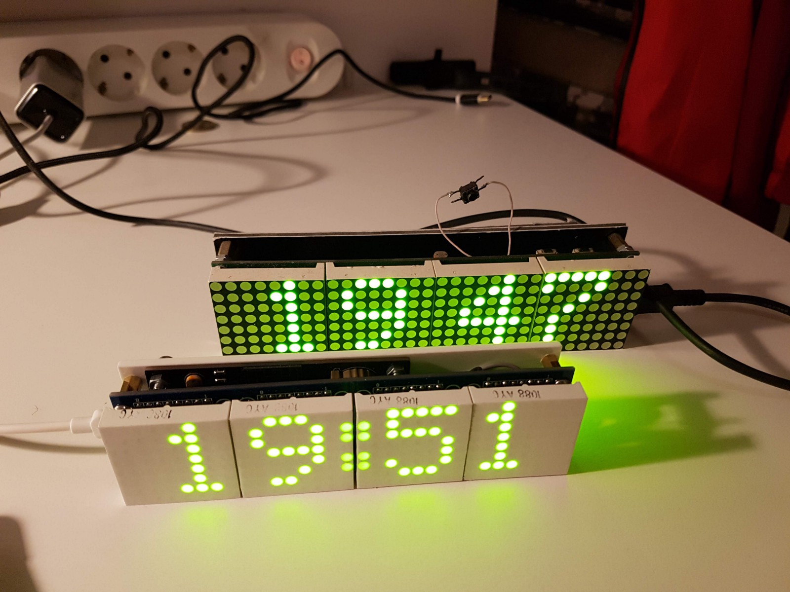

# LED Matrix Clock

These clock are build using ESP8266 module ESP-12. Arduino IDE was used for the firmware development and upload.

## Features

* Built on ESP8266 WiFi module
* Time updates via NTP protocol
* Automatic time zone support
* Timekeeping without Internet connection (DS3231 chip)
* Brightness auto adjust

## Dependencies

* WiFi Manager - [https://github.com/tzapu/WiFiManager](https://github.com/tzapu/WiFiManager)
* Time library - [https://github.com/PaulStoffregen/Time](https://github.com/PaulStoffregen/Time)
* Time zone library - [https://github.com/JChristensen/Timezone](https://github.com/JChristensen/Timezone)
* NTP Client - [https://github.com/gmag11/NtpClient](https://github.com/gmag11/NtpClient)
* RTC library - [https://github.com/Makuna/Rtc](https://github.com/Makuna/Rtc)
* MAX7219 library - [https://github.com/snakeye/MAX7219_Display](https://github.com/snakeye/MAX7219_Display)
